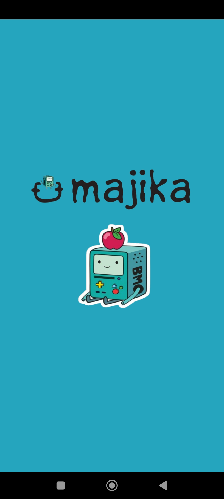
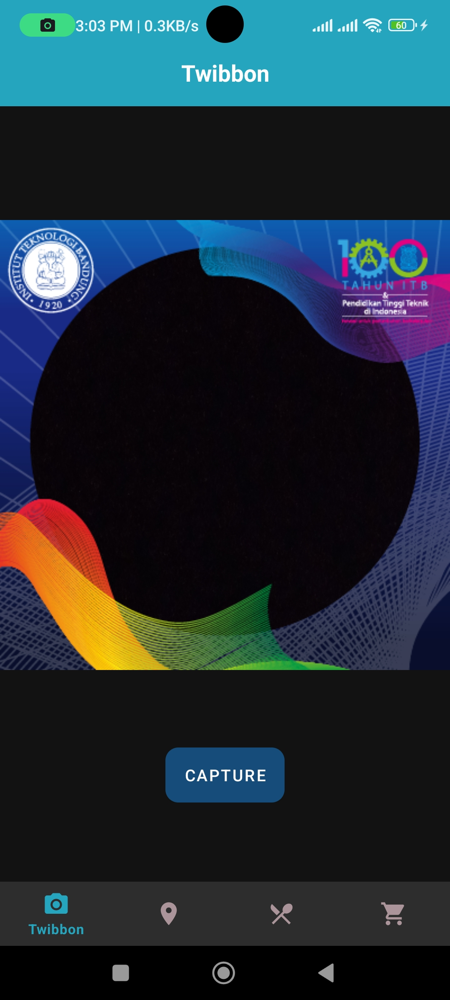
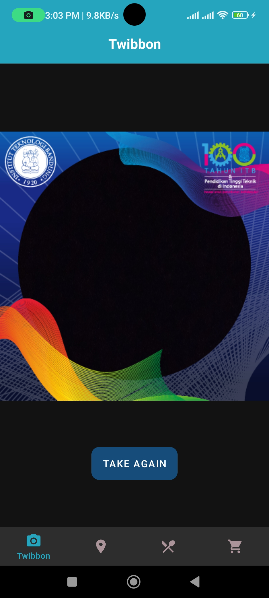
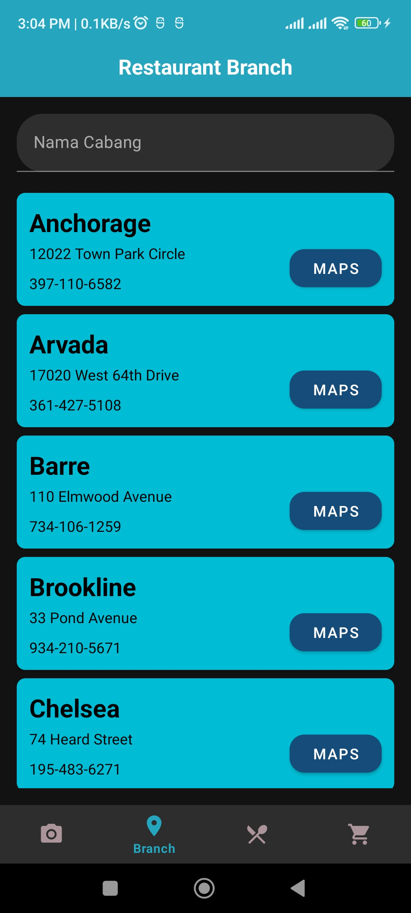
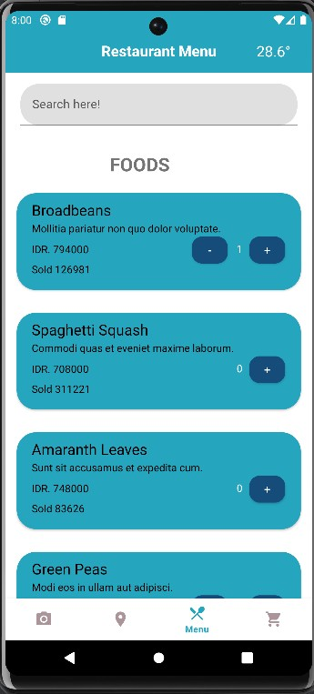
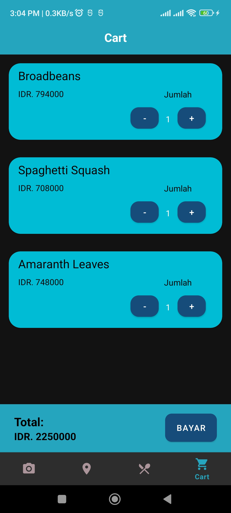
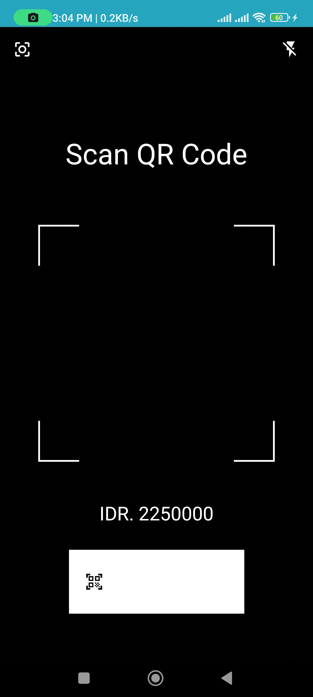
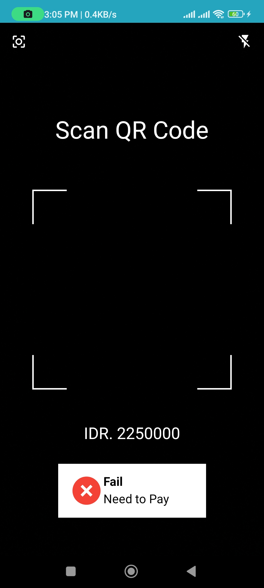
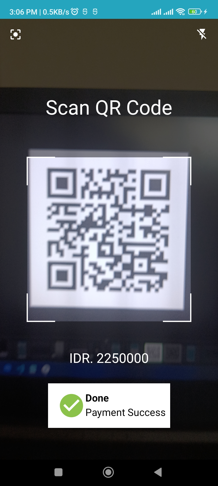

# Tugas Besar 1 - Android
# IF3210 Pengembangan Aplikasi pada Platform Khusus

## Deskripsi
Aplikasi Majika adalah sebuah aplikasi pembelian makanan berbasis Android yang digunakan untuk melakukan pembelian makanan dan minuman secara daring. Aplikasi ini dibangun dengan menggunakan Kotlin-Android Native. Aplikasi ini memiliki 5 fitur utama sebagai berikut.
1. Fitur Menu  
    Pada halaman ini, pengguna dapat melihat daftar makanan dan minuman yang tersedia untuk dimasukkan ke dalam keranjang. Pengguna juga dapat mencari makanan atau minuman dengan search bar yang disediakan pada halaman ini.
2. Fitur Keranjang  
    Pada halaman ini, pengguna dapat melihat daftar makanan dan minuman yang telah dipesan sebelum melakukan pembayaran. Pengguna juga dapat mengurangi dan/atau menambahkan jumlah makanan/minuman. Halaman ini juga menampilkan total harga yang harus dibayarkan beserta tombol bayarnya.
3. Fitur Pembayaran  
    Pada halaman ini, pengguna akan melakukan pembayaran dengan melakukan scan QR Code. Jika pembayaran berhasil, akan ditampilkan pesan pembayaran berhasil selama 5 detik, dan pengguna di-redirect ke Halaman Menu. Jika pembayaran gagal, pengguna harus melakukan scan ulang sampai sukses.
4. Fitur Cabang Restoran  
    Pada halaman ini, pengguna dapat melihat daftar cabang restoran. Pada setiap cabang restoran terdapat tombol "Maps" yang akan mengarahkan pengguna ke Google Maps sesuai dengan lokasi restoran yang ditekan.
5. Fitur Twibbon  
    Pada halaman ini, pengguna dapat melakukan capture gambar dari kamera yang sudah dipasang twibbon. Pengguna juga dapat mengambil foto ulang jika dirasa kurang puas dengan hasilnya.

## Library
- [Android KTX](https://developer.android.com/kotlin/ktx)
- [Retrofit](https://www.geeksforgeeks.org/retrofit-with-kotlin-coroutine-in-android/)
- [Coroutine](https://developer.android.com/kotlin/coroutines)
- [Code Scanner (Yuriy Budiyev)](https://github.com/yuriy-budiyev/code-scanner)
- [Room](https://developer.android.com/training/data-storage/room)
- [Espresso](https://developer.android.com/training/testing/espresso/basics)

## Screenshot

## Pembagian Kerja
| NIM      | Nama                        | Task                                       | Waktu yang Dibutuhkan               |
|----------|-----------------------------|--------------------------------------------|-------------------------------------|
| 13520123 | Johannes Winson Sukiatmodjo | Halaman Keranjang, Halaman Pembayaran      | 6 jam persiapan + 30 jam pengerjaan |
| 13520135 | Muhammad Alif Putra Yasa    | Header dan Navbar, Halaman Cabang Restoran | 6 jam persiapan + 30 jam pengerjaan |
| 13520137 | Muhammad Gilang Ramadhan    | Halaman Menu, Halaman Twibbon              | 6 jam persiapan + 30 jam pengerjaan |